# Arquitetura do Sistema — Clube do Pão

Documento de arquitetura do MVP (entregável da prática "Criando a arquitetura de um sistema"). As decisões pontuais estão registradas como ADRs em [`architecture.md`](architecture.md); as regras de negócio, em [`business-rules.md`](business-rules.md).

## 1. Visão Geral

O **Clube do Pão** digitaliza a operação de padarias de bairro em duas frentes:

- **Assinatura do Kit Pão Quente:** o cliente escolhe quantidade e faixa de horário; a padaria enxerga a demanda do dia e a rota de entrega.
- **Marketplace de fornadas:** o consumidor vê no mapa onde o pão está saindo do forno, reserva pagando na hora ou assina um plano; a padaria agenda fornadas e é apoiada por agentes de IA.

### Problema

- Toda vez que o cliente chega à padaria, o pão já não está quente.
- O cliente não tem tempo de ir à padaria todo dia.
- A padaria produz no escuro: sem previsão de demanda, sobra ou falta pão.

### Solução

Cronograma de fornadas em tempo real, mapa de padarias próximas, reservas com pagamento antecipado, assinaturas recorrentes e agentes que apoiam produção, matchmaking, rotas e retenção.

---

## 2. Funcionalidades Principais

| # | Funcionalidade | Onde |
|---|----------------|------|
| 1 | Assinatura simples do Kit Pão Quente (quantidade e faixa de horário) | `/cliente` |
| 2 | Painel da padaria: demanda do dia, rota por horário e despacho com notificação simulada | `/padaria` |
| 3 | Cardápio ilustrado dos pães | `/cardapio` |
| 4 | Contas com três papéis e login | `/cadastro`, `/login` |
| 5 | Cadastro de padarias e produtos | `/operacao` |
| 6 | Cronograma de fornadas com status em tempo real | `/fornadas`, `/operacao` |
| 7 | Mapa de padarias próximas | `/mapa` |
| 8 | Reserva com pagamento antecipado (simulado) | `/fornadas`, `/reservas` |
| 9 | Assinaturas por plano com cashback | `/assinaturas` |
| 10 | Quatro agentes de IA: demanda, matchmaking, rotas e retenção | `/mapa`, `/operacao` |

---

## 3. Diagrama de Arquitetura (Camadas)

### 3.1 Visão em camadas — Frontend → API → Banco

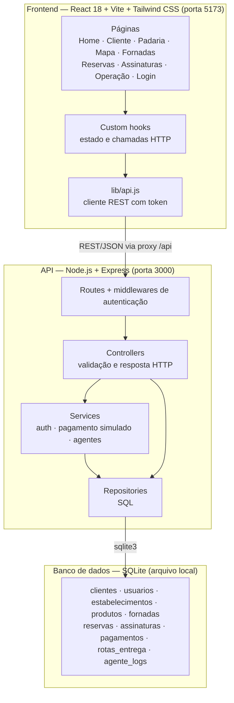

### 3.2 Componentes por tipo de usuário

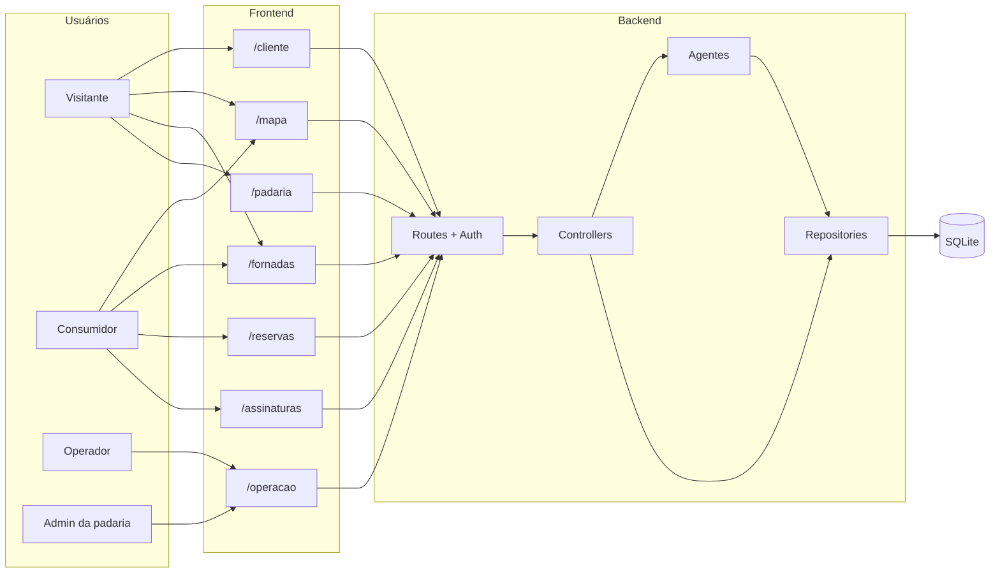

### 3.3 Organização do código

```
ai/
├── docs/
│   ├── standards.md, architecture.md, tech-stack.md, business-rules.md   # arquivos de contexto
│   └── prd.md, arquitetura-sistema.md                                    # produto e arquitetura
├── backend/src/
│   ├── routes/          # rotas Express
│   ├── middlewares/     # requireAuth, requireRole
│   ├── controllers/     # validação de entrada e resposta
│   ├── services/        # auth, pagamento simulado e agents/
│   ├── repositories/    # consultas SQL
│   ├── database/        # conexão, schema e seed
│   └── __tests__/       # testes de API (node --test)
└── frontend/src/
    ├── pages/           # telas
    ├── hooks/           # estado e chamadas HTTP por tela
    ├── components/      # PageShell, ScheduleCard, MapView...
    └── lib/             # cliente da API, sessão e formatação
```

---

## 4. Tipos de Usuários e Permissões

| Papel | O que faz |
|-------|-----------|
| **Visitante** (sem login) | Assina o Kit Pão Quente em `/cliente`; vê mapa e cronograma; acessa o painel `/padaria` do MVP base |
| **Consumidor** (`CONSUMER`) | Reserva fornadas, assina planos, usa o matchmaking |
| **Operador** (`ESTABLISHMENT_OPERATOR`) | Agenda fornadas, atualiza status, executa os agentes da operação |
| **Admin** (`ESTABLISHMENT_ADMIN`) | Tudo do operador e cadastro de padarias e produtos |

### 4.1 Matriz de permissões

| Ação | Visitante | Consumidor | Operador | Admin |
|------|:---------:|:----------:|:--------:|:-----:|
| Assinatura simples e painel `/padaria` | ✅ | ✅ | ✅ | ✅ |
| Ver mapa e cronograma | ✅ | ✅ | ✅ | ✅ |
| Matchmaking (buscar pão quente) | ❌ | ✅ | ✅ | ✅ |
| Reservar e assinar plano | ❌ | ✅ | ❌ | ❌ |
| Agendar fornada e mudar status | ❌ | ❌ | ✅ | ✅ |
| Agentes de demanda, rotas e retenção | ❌ | ❌ | ✅ | ✅ |
| Cadastrar padaria | ❌ | ❌ | ❌ | ✅ |

### 4.2 Fluxo de autorização

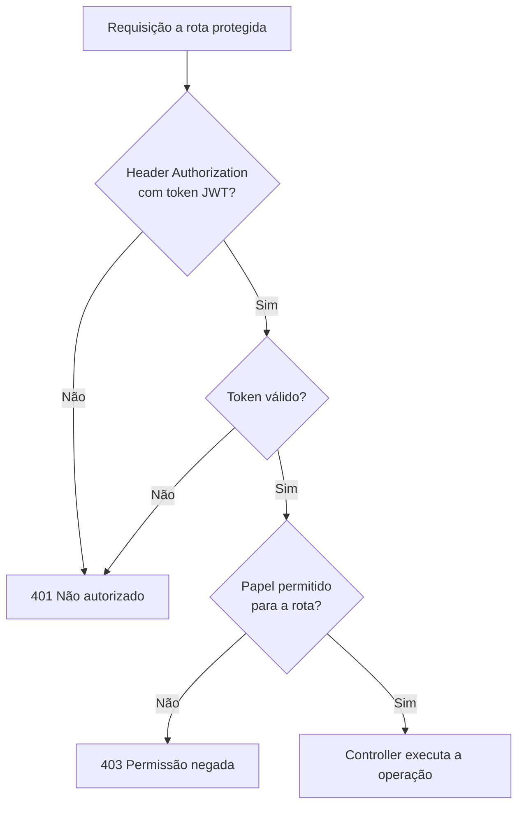

---

## 5. Entidades Principais e Relacionamentos

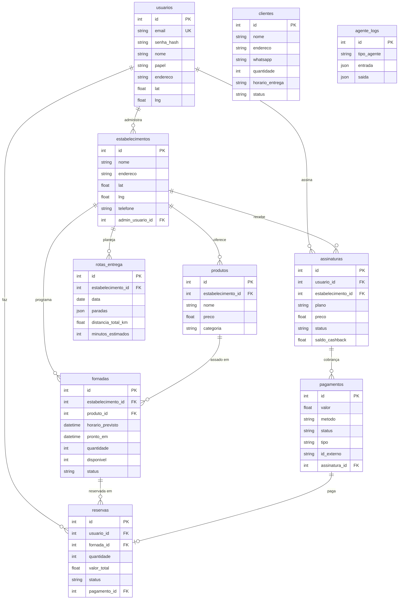

`clientes` é a assinatura simples do MVP base: não tem login e não se relaciona com as demais tabelas. `agente_logs` guarda a entrada e a saída de cada execução de agente.

---

## 6. Endpoints da API

Rotas marcadas com 🔒 exigem `Authorization: Bearer <token>`.

| Método | Rota | Papel | Descrição |
|--------|------|-------|-----------|
| GET | `/api/health` | — | Verificação do serviço |
| POST | `/api/clientes` | — | Assinatura simples (nome, endereço, WhatsApp, quantidade, faixa de horário) |
| DELETE | `/api/clientes` | — | Limpa a base de clientes (demonstração) |
| GET | `/api/pcp/demanda` | — | Total de clientes ativos e de pães a produzir |
| GET | `/api/pcp/rota` | — | Entregas ordenadas por faixa de horário |
| POST | `/api/pcp/despacho` | — | Inicia a rota e simula as notificações |
| POST | `/api/auth/cadastro` | — | Cria a conta e devolve o token |
| POST | `/api/auth/login` | — | Autentica e devolve o token |
| GET | `/api/estabelecimentos` | — | Lista padarias; filtro por `lat`, `lng` e `raio` |
| POST | `/api/estabelecimentos` | 🔒 Admin | Cadastra padaria e produtos |
| GET | `/api/fornadas` | — | Cronograma; filtro por `estabelecimento_id` e `status` |
| POST | `/api/fornadas` | 🔒 Admin, Operador | Agenda fornada |
| PATCH | `/api/fornadas/:id` | 🔒 Admin, Operador | Atualiza o status da fornada |
| GET | `/api/reservas` | 🔒 | Reservas do usuário |
| POST | `/api/reservas` | 🔒 Consumidor | Cria reserva com pagamento |
| GET | `/api/assinaturas` | 🔒 | Assinaturas do usuário |
| POST | `/api/assinaturas` | 🔒 Consumidor | Assina um plano |
| POST | `/api/agentes/matchmaking` | 🔒 | Melhor pão quente no raio |
| POST | `/api/agentes/previsao-demanda` | 🔒 Admin, Operador | Sugestão de produção por produto |
| POST | `/api/agentes/rotas` | 🔒 Admin, Operador | Rota otimizada do dia |
| POST | `/api/agentes/retencao` | 🔒 Admin, Operador | Notificações de upsell |

---

## 7. Tecnologias

| Camada | Tecnologia |
|--------|-----------|
| Frontend | React 18, Vite, Tailwind CSS, React Router, Lucide React |
| Mapa | Leaflet + React Leaflet, tiles do OpenStreetMap |
| Backend | Node.js 20, Express, CORS |
| Autenticação | JWT (`jsonwebtoken`) e hash de senha (`bcryptjs`) |
| Banco de dados | SQLite (`sqlite3`), arquivo local |
| Agentes | Módulos JavaScript determinísticos, prontos para troca por LLM |
| Testes | `node --test` na API; Vitest + Testing Library no frontend |
| Execução | 100% local: Vite na porta 5173 e API na porta 3000 |

Versões e bibliotecas homologadas estão em [`tech-stack.md`](tech-stack.md).

---

## 8. Fluxos Principais

### 8.1 Visão geral

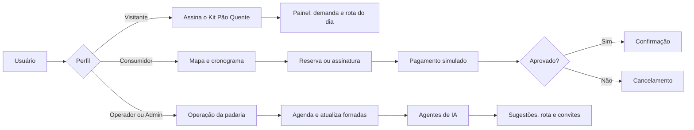

### 8.2 Assinatura simples e despacho (MVP base)

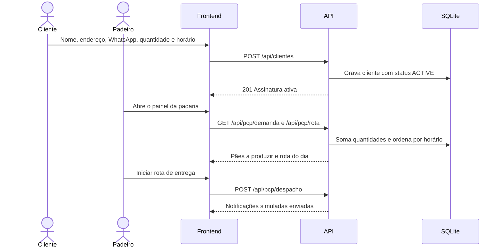

### 8.3 Ciclo de vida da fornada

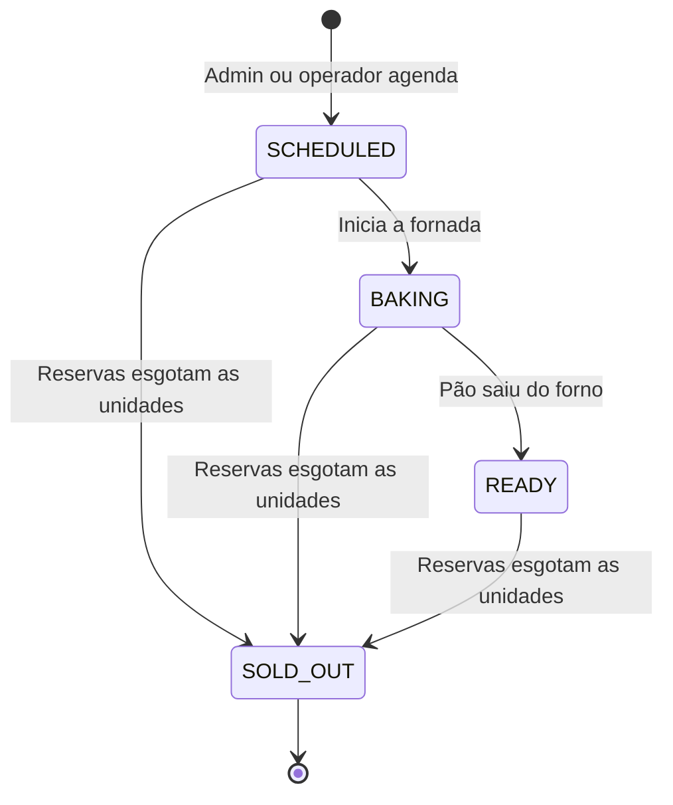

### 8.4 Reserva com pagamento

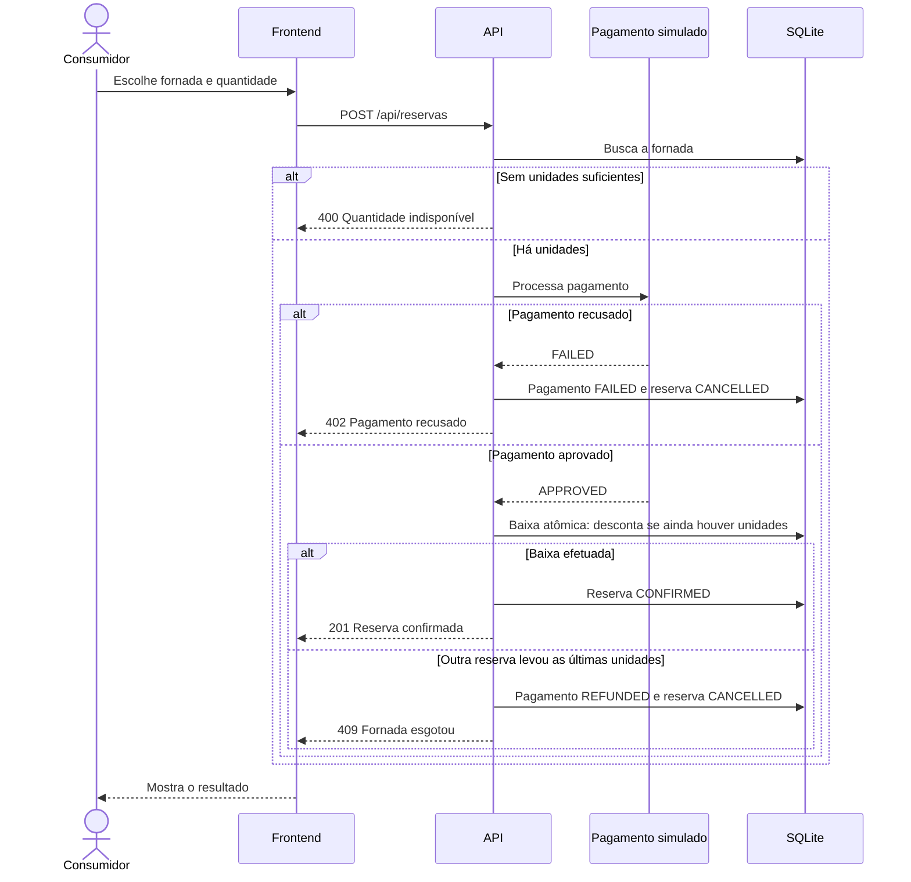

### 8.5 Assinatura por plano com cashback

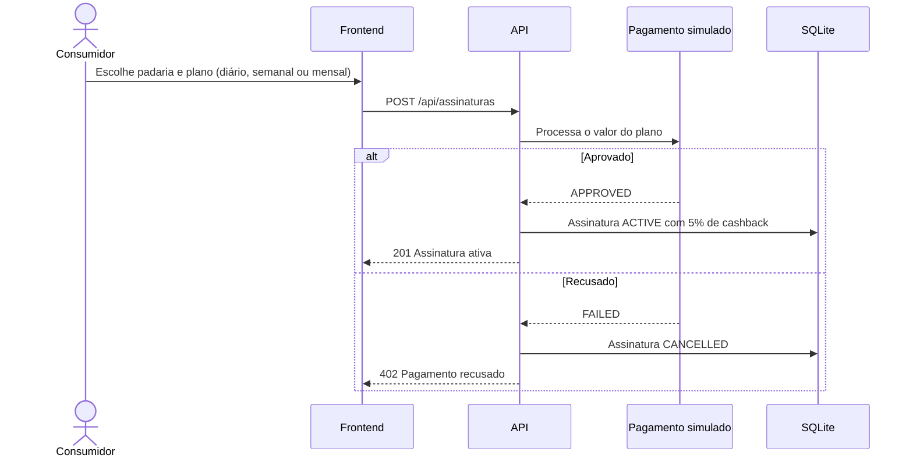

### 8.6 Mapa e matchmaking

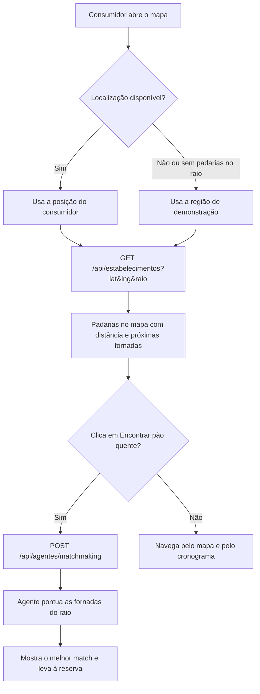

---

## 9. Agentes de IA

Os quatro agentes são módulos determinísticos em `backend/src/services/agents` (ADR 005). Cada execução é gravada em `agente_logs`.

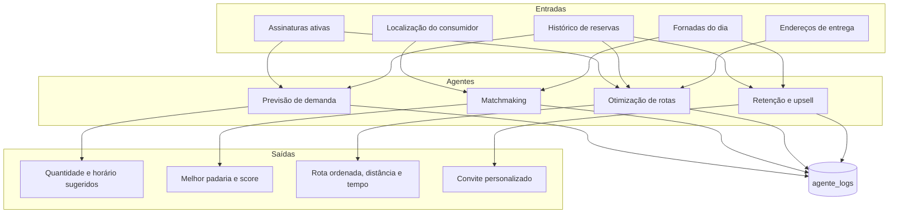

| Agente | Entrada | Regra | Saída |
|--------|---------|-------|-------|
| **Previsão de demanda** | Assinaturas ativas e reservas dos últimos 30 dias | (média por produto, ou 5 sem histórico, + 2 pães por assinatura divididos entre os produtos) × peso do dia da semana | Quantidade, horário e confiança por produto |
| **Matchmaking** | Localização, raio e produto opcional | Score = 50% status (`READY` 100, `BAKING` 80, `SCHEDULED` 40) + 30% proximidade + 20% disponibilidade | Lista ordenada e melhor match |
| **Otimização de rotas** | Assinantes ativos e reservas confirmadas do dia | Uma parada por consumidor; vizinho mais próximo a partir da padaria; 3 min por km + 5 min por parada | Paradas em ordem, distância e tempo |
| **Retenção e upsell** | Fornadas prontas e reservas dos últimos 60 dias | Quem pediu o produto ao menos 2 vezes no mesmo dia da semana recebe um convite | Mensagens personalizadas |

---

## 10. Decisões Arquiteturais

Resumo dos ADRs de [`architecture.md`](architecture.md):

1. **Cliente e servidor separados (ADR 001):** SPA React e API Node.js independentes; o frontend pode virar aplicativo nativo sem reescrever o backend.
2. **Demonstração 100% local (ADR 002):** sem dependência de deploy em nuvem na apresentação.
3. **Notificações simuladas (ADR 003):** log no servidor e aviso visual no lugar de WhatsApp ou SMS reais.
4. **Autenticação por JWT (ADR 004):** API sem estado, com papéis verificados em middleware.
5. **Agentes determinísticos (ADR 005):** resultado previsível e offline, com a mesma entrada e saída que um LLM usaria no futuro.
6. **Pagamento simulado (ADR 006):** fluxo completo de aprovado, recusado e estornado sem gateway real.
7. **Mapa com Leaflet e OpenStreetMap (ADR 007):** sem chave de API; é o único ponto que precisa de internet.

---

## 11. Limitações Conhecidas e Próximos Passos

- A assinatura simples (`clientes`) e a assinatura por plano (`assinaturas`) ainda são fluxos separados.
- Admin e operador não estão vinculados a uma padaria específica: qualquer um deles opera qualquer padaria.
- O cadastro permite escolher o papel livremente; em produção, o papel de admin exigiria aprovação.
- Próximos passos: gateway de pagamento real, notificações reais (WhatsApp ou push), LLM nos agentes de retenção e matchmaking e aplicativo móvel.
